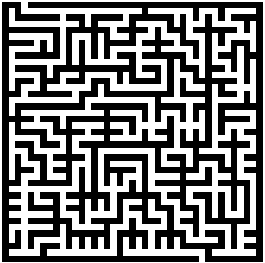
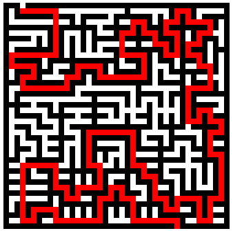

# Mazesolving in Go

A version of [mazesolving](https://github.com/mikepound/mazesolving) in Go

```
go build
./mazesolver -i input.png
xdg-open output.png
```

You might want to toggle anti-aliasing in your image viewer

|          Input          |          Output          |
| :---------------------: | :----------------------: |
||
